# Procesverslag
Markdown is een simpele manier om HTML te schrijven.  
Markdown cheat cheet: [Hulp bij het schrijven van Markdown](https://github.com/adam-p/markdown-here/wiki/Markdown-Cheatsheet).

Nb. De standaardstructuur en de spartaanse opmaak van de README.md zijn helemaal prima. Het gaat om de inhoud van je procesverslag. Besteedt de tijd voor pracht en praal aan je website.

Nb. Door *open* toe te voegen aan een *details* element kun je deze standaard open zetten. Fijn om dat steeds voor de relevante stuk(ken) te doen.

## Jij

uitwerken voor kick-off werkgroep

### Auteur:
Roos Horselenberg

#### Je startniveau:
blauw

#### Je focus:
surface plane
 

## Je website

uitwerken voor kick-off werkgroep

### Je opdracht:
pansy-shop.com

#### Screenshot(s) van de eerste pagina (small screen): 
De startpagina: screenshot wil helaas niet goed werken.

#### Screenshot(s) van de tweede pagina (small screen):
shop: screenshot wil helaas niet goed werken.

 

## Breakdownschets (week 1)

uitwerken na afloop 2e werkgroep

### de hele pagina: 
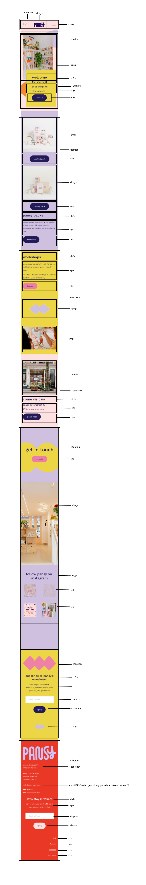

### dynamisch deel (bijv menu): 
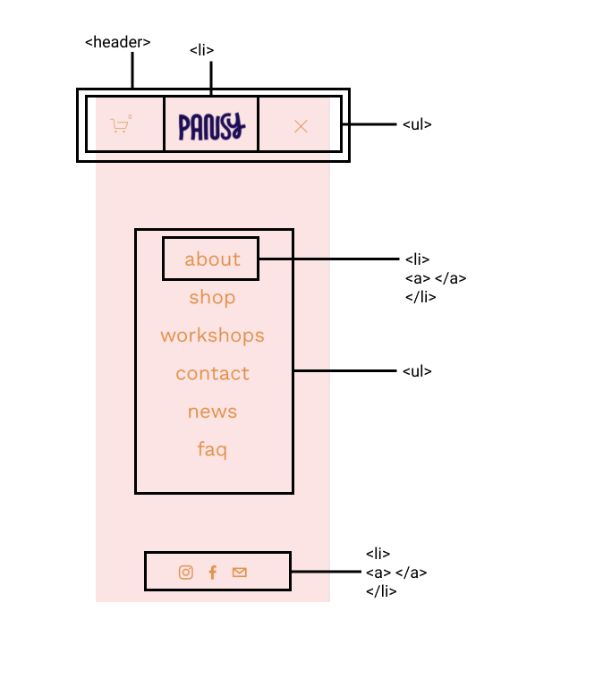

## Voortgang 1 (week 2)

uitwerken voor 1e voortgang

### Stand van zaken
Problemen die ik heb:
- De werking van de site op telefoon formaat;
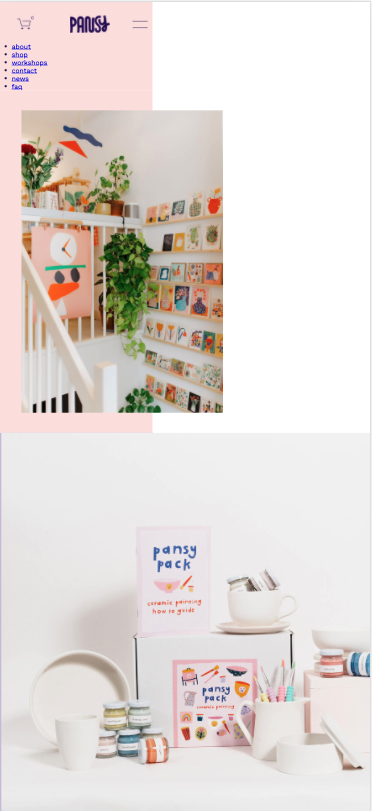

- Probleem centreren elementen;
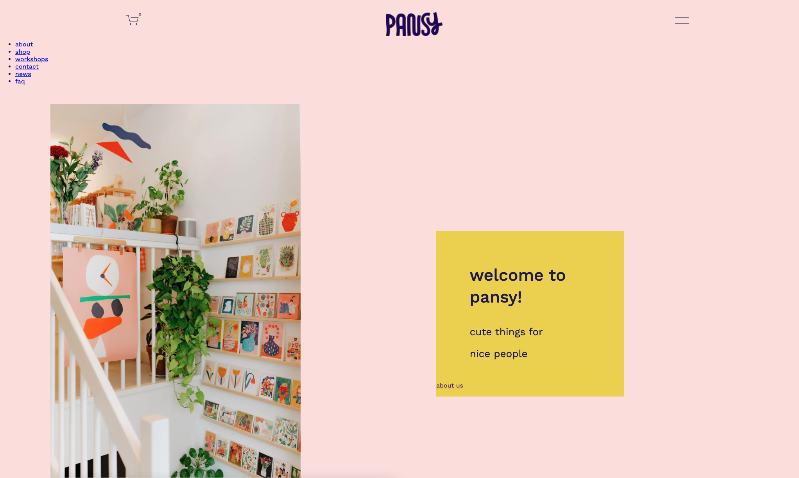

### Agenda voor meeting
samen met je groepje opstellen

Roos:
- Hulp met het schalen op mobiel formaat.

Mina:
- Hulp met schalen.

Valerie:
- Hulp met centreren.
- Wat moet er in de footer?

Merel:
- Nog wat problemen met css.

### Verslag van meeting

- Zorg dat je de width en height zoveel mogelijk aangeeft in procenten;
- Geef geen width en height aan bij a's maar gebruik padding;
- Vervang de div'jes voor een ander element;
- classes mogen eigenlijk alleen gebruikt worden bij sections.

## Voortgang 2 (week 3)

uitwerken voor 2e voortgang

### Stand van zaken
Ik had wat problemen met mijn css en hoe bepaalde elementen waren opgetseld. Daarom ben ik nu bezig met het opnieuw opstellen van mijn css en dat gaat to nu goed. Zo heb ik al een aantal dingen op kunnen plassen zoals de navbar.

## Navbar

before:
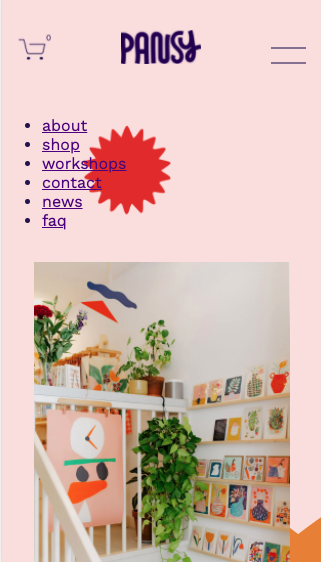

after:
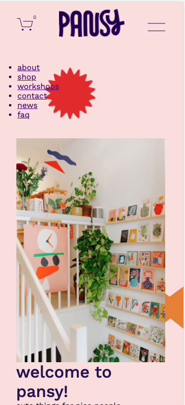

## Opstelling tekst

before:
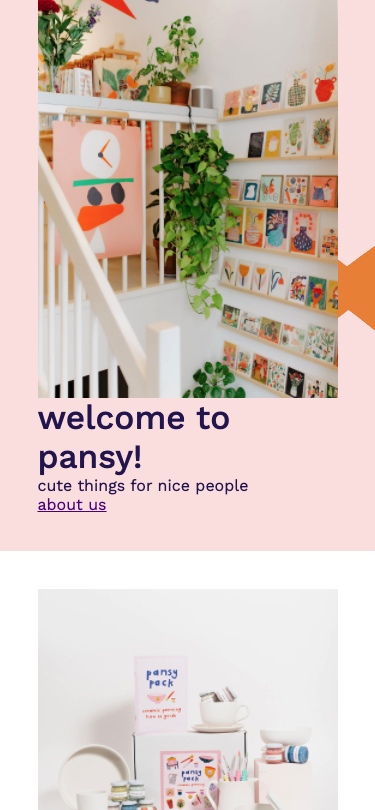

after:
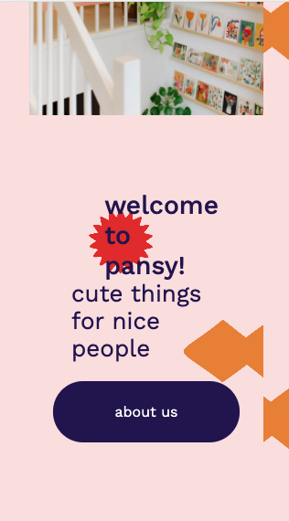

Verder heb ik nog wat problemen met het hamburgermenu dus daar hoop ik hulp mee te krijgen tijdens het voortgangsgesprek.

### Agenda voor meeting
Roos:
- Hulp met het maken van een full screen hamburgermenu en het gele tekstblok uit mijn site;

Mina:
- Hulp met het hamburgermenu en hoe je een slider maakt met afbeeldingen als een soort van carousel;

Valerie:
- Wil ook weten hoe je een slider carousel maakt en een hamburger menu, ook snapt ze nog niet helemaal wat ze met de bronnen moet doen.

Julia:
- Wil ook graag weten heo ze een hamburger menu kan maken.

### Verslag van meeting
hier na afloop snel de uitkomsten van de meeting vastleggen

- Width 100% was heel belangrijk bij wat elementen om ze op de goede plaats te krijgen dit weet ik voor de volgende keer om dit ook eerst eens uit te proberen.

## Toegankelijkheidstest (week 4)

uitwerken na test in 8e voortgang

### Bevindingen
- Dingen die niet te zien zijn zoals een uitklapbaar hamburgermenu worden ook voor gelezen.
- Om een screenreader goed te begrijpen heb je soms langere omschrijvingen nodig dan een kleine korte omschrijving.
- Ik moet een tag even veranderen naar het juiste semantische element omdat je hem nu niet kan bereiken met tab. Verder lukt het allemaal al vrij aardig met het toetsenbord.
- Verder vond ik het nog moeilijk om me goed in te leven in mensen met spasmes omdat ik mijn arm niet naar beneden kon draaien om mijn website te bedienen. Ik denk dat zij wel vooral baat zullen hebben bij het goed kunnen navigeren via toetsenbord.
- Ook kon ik door de brillen nog aardig kijken dus hier kon ik me ook nog niet zo goed inleven, ik denk dat dit misschien ook komt omdat ik mijn site natuurlijk al beter ken.

#### Onzichtbaar hamburgermenu
Toen ik begon met de screen reader test liep ik er tegenaan dat hij het hamburgermenu ook ging voorlezen ookal was hij op dat moment niet in het scherm. Dit heb ik kunnen oplossen met :focus-within de navbar opent nu automatisch, zo is de navbar ook in beeld als hij wordt gelezen en kan je er ook mee interacteren. Zo kan je nu ook makkelijk het hamburgermenu openen door te tabben en hoef je niet tussendoor op enter te drukken.

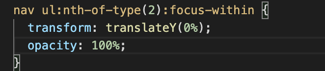

#### Langere beschrijving. 
Opzich kan je het met een screenreader al wel snappen, alleen is het wel leuker als je soms even wat meer context hebt zodat je hetzelfde meekrijgt als iemand die wel goed kan zien.

Ik heb nu nog omschrijvingen die vrij to the point zijn:

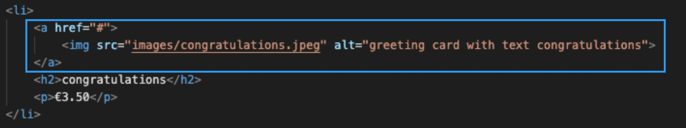

Ik zou dus nog wat korte verhaaltjes bij bepaalde elementen kunnen schrijven die een betere impressie geven van wat er op het scherm te zien is.

#### Niet zichtbaar via tab. 
Ik heb nu nog dat als ik door mijn navigatie heen tab dat de shopping cart niet wordt meegepakt via de focus. Dit komt omdat het elemant nog niet semantisch is. Hier ga ik dus nog een a tag omheen zetten zodat hij wel wordt opgepakt.

## Voortgang 3 (week 4)

uitwerken voor 3e voortgang

### Stand van zaken
Het ging eigenlijk wel goed maar ik heb wel een paar kleine probleempjes waar ik tijdens het voortgangsgesprek wat hulp bij kan krijgen namelijk:

- De social media links in het hamburgermenu komen alleen tevoorschijn als je er doorheen bent getabt soms staan ze ook opeens in een column in plaats van een row. Ik heb al wat dingen geprobeerd maar ik weet niet zo snel waar de fout zit.

Dit zijn de verschillende staten ervan:

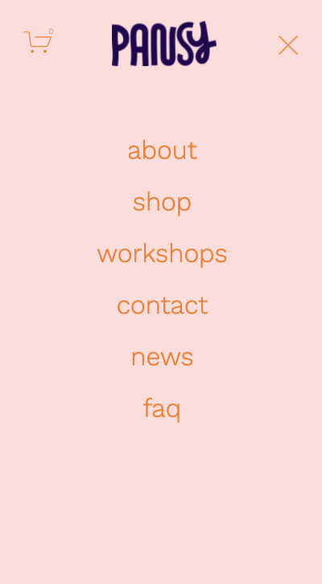

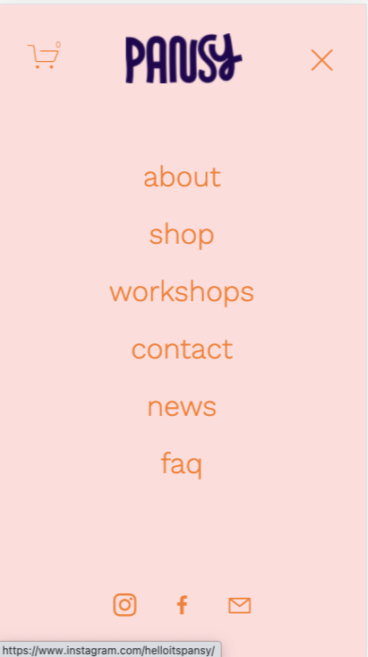

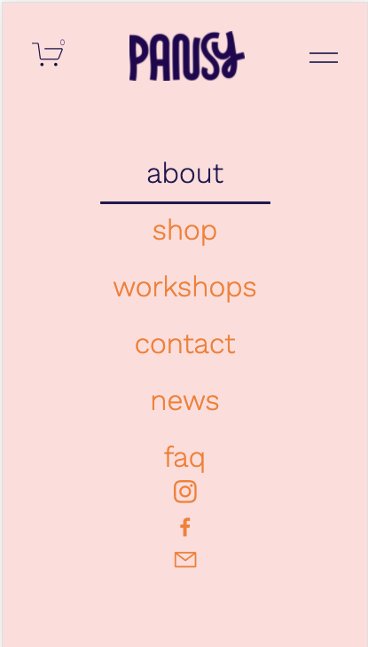

Verder moet ik ook nog eeen manier vinden hoe ik sommige titels moet omdraaien in mijn css om correcte html te houden in mijn sections hier hoop ik ook nog wat hulp bij te krijgen.

Ook heb ik nog een probleem met de focus van de social media in mijn footer dit gebeurt er nu namelijk en ik wil dat dit alleen om de logo's staat.

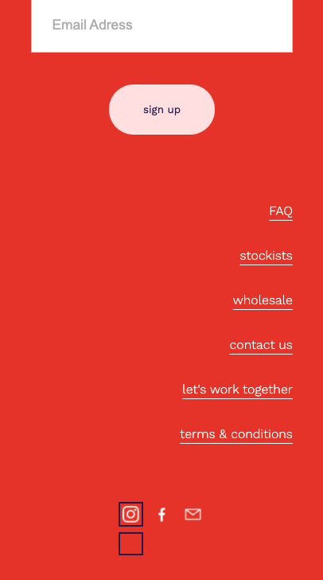

### Agenda voor meeting
samen met je groepje opstellen

Roos:
- Hulp met wat problemen van de focus states;
- Hulp met de socials in hamburgermenu;
- Het omdraaien van elementen uit de html in mijn css

Mina:
- JavaScript;
- Het linken van een live instagram hashtag

Valerie:
?

Merel:
?

### Verslag van meeting
hier na afloop snel de uitkomsten van de meeting vastleggen

- Op de onderdelen die ik wilde omdraaien stond al flex, ik moest dus alleen nog order gebruiken om het even om te draaien.
- Ik moest wat andere semantische elementen gebruiken en mijn html structuur veranderen zodat de social media links niet meer zouden botsen met de rest van mijn navigatie.
- Het focus link probleem in mijn footer was ook vrij snel opgelost door wat paddings en margins te veranderen. Ik moet ook gewoon sneller als ik een probleem heb mijn dev-tools erbij pakken daar kan ik het probleem vaak al vinden.

## Eindgesprek (week 5)

uitwerken voor eindgesprek

### Stand van zaken
Dit ging goed:
- Het maken van de verschillende thema's ging eigenlijk vrij gemakkelijk;
- Ik heb tijdens dit vak veel nieuwe selectoren geleerd zoals nth-type() of first-of-type enz. Dit maakte het selecteren veel makkelijker. Als ik hier vorig jaar van af had geweten had dat mij veel tijd gescheelt.

- Het gebruiken van display:grid vond ik ook erg fijn werken ik had zo de structuur van de shop-pagina ook vrij snel in elkaar gezet.

Dit ging lastig:
- Het maken van de navigatiebar en het hamburgermenu heeft me het meeste tijd gekost. Ik kwam elke keer gekke bugs tegen die dingen dan weer niet goed lieten werken. Het heeft me soms flink wat tijd gekost om er achter te komen wat het probleem nou precies veroorzaakte. Gelukkig kwam ik verder in het vak erachter hoe handig DevTools kan zijn. Ik heb er wel veel van geleerd en ook vooral hoe ik focus goed moet laten werken op elementen die dus niet altijd in beeld zijn hier ben ik erg blij mee. Een voorbeeldje hiervan is:

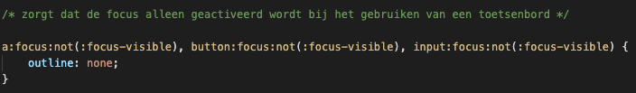

- Met wat hulp van Rowin heb ik een loop in mijn javascript gemaakt, ik begrijp het nu redelijk maar ik vind het nog wel een lastig onderdeel waar ik wel meer over zou willen leren.

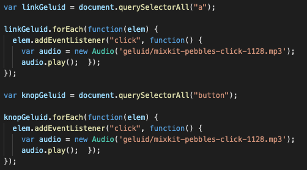

- Verder nog wat andere stukken code die ik via uitleg van sites heb gemaakt maar nog niet compleet begrijp zo als deze, hier zou ik ook nog meer over willen leren.

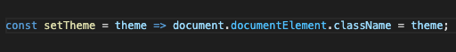

### Screenshot(s)

hier screenshot(s) van je eindresultaat

Startpagina light:

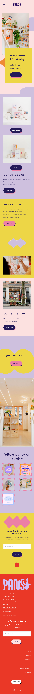

Startpagina dark:

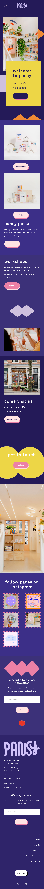

Startpagina color remove:

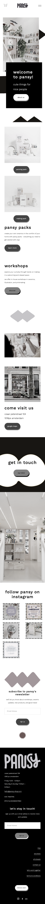

Shop light:

Shop dark:

Shop color remove:

## Bronnenlijst

continu bijhouden terwijl je werkt

Bronnen staan die ik heb gebruikt staan ook direct in de code:

1. https://webdesign.tutsplus.com/tutorials/color-schemes-with-css-variables-and-javascript--cms-36989
2. https://codepen.io/shooft/pen/jOMOroZ*/
3. https://codepen.io/shooft/pen/yLOdLBg
4. https://stackoverflow.com/questions/6805482/css3-transition-animation-on-load
5. https://flaviocopes.com/dark-mode-change-img-source/

